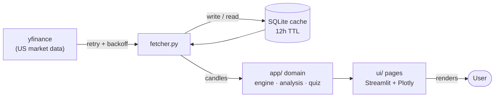

# 🎓 Trading Education Platform

[](https://github.com/bugra123uysal/Trading_Education_Platform/actions/workflows/ci.yml)
[](LICENSE)

Live demo: https://trade-egitim.streamlit.app/


**English** | [Türkçe](#-türkçe)

Problem: After learning trading concepts, beginners need a safe environment to practice. Existing solutions rarely focus on education, making it difficult to gain experience without risking real capital.

A trading learning platform built entirely in Python, powered by **real US market data**. It combines a backtesting engine, scenario-based quizzes, and a clickable glossary in a single Streamlit application.

> *Learn with real data — without risking real money.*

## 🏗️ Architecture

One Streamlit app, one process, one language. No separate API server, no JavaScript. The UI calls the same Python functions (`run_backtest`, `get_candles`, …) directly — no HTTP/JSON layer in between.

- **UI**: [Streamlit](https://streamlit.io) + [Plotly](https://plotly.com/python/) (candlestick charts)
- **Data**: fetched via [yfinance](https://github.com/ranaroussi/yfinance), cached in SQLite with a 12-hour TTL
- **Database**: SQLite (`backend/data.db`, auto-created) + SQLAlchemy ORM (2.x)



> **Cache note:** On Streamlit Cloud the disk is ephemeral, so `data.db` is **not** persistent — it is reset on every restart/redeploy and re-populated on first lookup. A `@st.cache_data` layer over the SQLite cache keeps repeated in-process lookups fast.

## 📁 Project Structure

```
.github/workflows/ci.yml     # CI: ruff + pytest on Python 3.11 & 3.12
pyproject.toml               # ruff + pytest configuration
LICENSE                      # MIT
backend/
  streamlit_app.py           # Entry point — `streamlit run streamlit_app.py`
  app/
    database.py              # SQLite connection
    models.py                # ORM tables
    indicators.py            # EMA, dollar-volume columns
    analysis.py              # Event detection (crosses, swings, gaps, patterns, Qullamaggie setups)
    data/fetcher.py          # yfinance + caching logic (retry, resilience)
    data/seed_glossary.py    # Glossary seed data
    data/seed_quiz.py        # Quiz question seed data
    backtest/strategies.py   # MA crossover, RSI threshold strategies
    backtest/engine.py       # Trade simulation + performance metrics
    quiz/scenario.py         # Scenario quiz generation
    quiz/grading.py          # Answer grading + progress tracking
  ui/
    dashboard.py             # Charts page
    education.py             # Technical analysis lessons on real charts
    replay.py                # TradingView-style bar replay
    quiz.py                  # Quiz page (gamified scenario + knowledge tests)
    glossary.py              # Glossary page
    common.py                # Shared helpers (chart rendering, cached candle loader)
  tests/                     # Offline pytest suite (engine, strategies, grading)
  .streamlit/config.toml     # Dark theme settings
```

## 🛠️ Features

1. **Charts** — Candlestick charts with real historical data (MU, NVDA, AAPL, TSLA, MSFT)
2. **Technical Analysis Education** — 11 lessons, each explaining a concept then marking **real, dated examples** detected automatically on real charts: market structure (HH/HL), support/resistance, candle patterns, moving-average crosses, RSI, Bollinger/ATR, volume, gaps, Fibonacci, risk management, and the **Qullamaggie swing setups** (Breakout, Episodic Pivot, Parabolic)
3. **Chart Replay** — TradingView-style bar replay: rewind a real chart to a past date and play it forward day by day to practice reading price action without seeing the future
4. **Quizzes**
   - *Gamified scenario*: start with a $100 balance and profit targets; a random moment from a real stock's history is shown — Buy / Short / Wait — then the outcome updates your balance, marks your entry point, and gives educational feedback
   - *Knowledge tests*: fundamentals, technical analysis, risk management, and chart reading, with explanations shown for both correct and incorrect answers
5. **Glossary** — Plain-language term explanations, searchable on its own page and embedded contextually (via `st.expander`) across the app

The backtest engine (`app/backtest/`) remains the most heavily tested module and powers the offline test suite, even though the standalone backtest page was retired in favour of Chart Replay.

## 🚀 Setup & Run

```bash
cd backend
python -m venv venv
# Windows:
venv\Scripts\activate
# macOS/Linux:
source venv/bin/activate

pip install -r requirements.txt
streamlit run streamlit_app.py
```

Or, the minimal one-liner once dependencies are installed:

```bash
cd backend && pip install -r requirements.txt && streamlit run streamlit_app.py
```

The app opens automatically in your browser (default: http://localhost:8501). On first launch it creates the SQLite tables, seeds the glossary and quiz questions (only missing entries are added), and caches yfinance data for 12 hours after the first lookup.

## 🧪 Tests

```bash
pip install pytest ruff
pytest backend/tests -q      # offline test suite (engine, strategies, grading)
ruff check backend           # lint
```

Tests are fully offline — deterministic OHLCV fixtures, an in-memory SQLite database, and no network access. CI runs them on Python 3.11 and 3.12.

## ➕ Adding Terms & Questions

- Add a term: append a `dict` to the `TERMS` list in `backend/app/data/seed_glossary.py`
- Add a quiz question: append to the `QUESTIONS` list in `backend/app/data/seed_quiz.py`
- Seed functions are **incremental** — they add only entries not already in the database, so a full restart picks up new ones without deleting `data.db`. Note that `@st.cache_resource` runs seeding once per process, so on Streamlit Cloud use **Reboot app** (or locally, fully stop and restart) to load new entries.

## 🤔 Why This Architecture

An earlier version used a separate FastAPI server plus a JavaScript frontend — two processes, two languages. Migrating to Streamlit removed the entire HTTP/JSON layer: every page in `ui/` now calls the same Python functions in `app/` directly, and a single command runs the whole application.

## ⚠️ Disclaimer

Educational tool only. Not investment advice.

---

# 🇹🇷 Türkçe
canlı demo: https://trade-egitim.streamlit.app/

Sorun: Alım-satım kavramlarını öğrendikten sonra, yeni başlayanların pratik yapabilecekleri güvenli bir ortama ihtiyaçları vardır. Mevcut çözümler nadiren eğitime odaklandığından, gerçek sermayeyi riske atmadan deneyim kazanmak zorlaşmaktadır.

Gerçek ABD borsa verileriyle çalışan, tamamen Python'da yazılmış bir trading öğrenme platformu. Backtest motoru, senaryo bazlı quizler ve tıklanabilir terim sözlüğünü tek bir Streamlit uygulamasında birleştirir.

> *Gerçek verilerle öğren, gerçek parayla riske girme.*

## 🏗️ Mimari

Tek Streamlit uygulaması, tek süreç, tek dil. Ayrı API sunucusu yok, JavaScript yok. Arayüz, aynı Python fonksiyonlarını (`run_backtest`, `get_candles`, …) doğrudan çağırır — arada HTTP/JSON katmanı yoktur.

- **Arayüz**: [Streamlit](https://streamlit.io) + [Plotly](https://plotly.com/python/) (mum grafikleri)
- **Veri**: [yfinance](https://github.com/ranaroussi/yfinance) ile çekilir, SQLite'a cache'lenir (12 saatlik TTL)
- **Veritabanı**: SQLite (`backend/data.db`, otomatik oluşur) + SQLAlchemy ORM (2.x)

> **Cache notu:** Streamlit Cloud'da disk kalıcı değildir (ephemeral); `data.db` her yeniden başlatmada/dağıtımda sıfırlanır ve ilk sorguda yeniden dolar. SQLite cache'inin üstündeki bir `@st.cache_data` katmanı, süreç içi tekrar sorguları hızlı tutar.

## 🛠️ Özellikler

1. **Grafikler** — Gerçek geçmiş veriyle mum grafikleri (MU, NVDA, AAPL, TSLA, MSFT)
2. **Teknik Analiz Eğitimi** — 11 ders; her biri kavramı anlatır, sonra **gerçek grafiklerde gerçek tarihli örnekleri** otomatik tespit edip işaretler: piyasa yapısı (HH/HL), destek/direnç, mum formasyonları, hareketli ortalama kesişimleri, RSI, Bollinger/ATR, hacim, gap, Fibonacci, risk yönetimi ve **Qullamaggie swing setup'ları** (Breakout, Episodic Pivot, Parabolic)
3. **Grafik Oynatıcı** — TradingView tarzı bar replay: gerçek grafiği geçmiş bir tarihe geri sarıp gün gün ileri oynatarak, geleceği görmeden fiyat okuma pratiği
4. **Quiz**
   - *Oyunlaştırılmış senaryo*: $100 bakiye ve hedeflerle başlarsın; gerçek bir hissenin geçmişinden rastgele bir an gösterilir — Al / Açığa Sat / Bekle — sonra sonuç bakiyeni günceller, giriş noktanı işaretler ve eğitici geri bildirim verir
   - *Bilgi testleri*: Temel kavramlar, teknik analiz, risk yönetimi ve grafik okuma; doğru ya da yanlış cevapta da açıklama gösterilir
5. **Terim Sözlüğü** — Sade dille yazılmış terim açıklamaları; hem kendi sayfasında aranabilir liste olarak, hem de uygulama genelinde bağlam içinde (`st.expander` ile) gösterilir

## 🚀 Kurulum ve Çalıştırma

```bash
cd backend
python -m venv venv
# Windows:
venv\Scripts\activate
# macOS/Linux:
source venv/bin/activate

pip install -r requirements.txt
streamlit run streamlit_app.py
```

Bağımlılıklar kurulduysa tek satırlık kısayol:

```bash
cd backend && pip install -r requirements.txt && streamlit run streamlit_app.py
```

Uygulama tarayıcıda otomatik açılır (varsayılan: http://localhost:8501). İlk açılışta SQLite tablolarını oluşturur, sözlük ve quiz verilerini yükler (yalnızca eksik kayıtları ekler) ve ilk bakılan hissenin verisini 12 saat boyunca cache'ler.

## 🧪 Testler

```bash
pip install pytest ruff
pytest backend/tests -q      # ağ erişimsiz test paketi (engine, strategies, grading)
ruff check backend           # lint
```

Testler tümüyle çevrimdışıdır — deterministik OHLCV fixture'ları, bellek içi SQLite ve sıfır ağ erişimi. CI, testleri Python 3.11 ve 3.12'de çalıştırır.

## ➕ Yeni Terim / Soru Ekleme

- Terim: `backend/app/data/seed_glossary.py` içindeki `TERMS` listesine yeni `dict` ekleyin
- Quiz sorusu: `backend/app/data/seed_quiz.py` içindeki `QUESTIONS` listesine ekleyin
- Seed fonksiyonları **artımlıdır** — sadece veritabanında olmayan kayıtları ekler, `data.db` silmeye gerek yok. `@st.cache_resource` tohumlamayı süreç başına bir kez çalıştırdığından, yeni kayıtlar için Streamlit Cloud'da **Reboot app** (ya da yerelde tamamen kapatıp yeniden başlatma) gerekir.

## 🤔 Neden Bu Mimari

Önceki sürümde ayrı bir FastAPI sunucusu ve JavaScript frontend vardı — iki süreç, iki dil. Streamlit'e geçişle HTTP/JSON katmanı tamamen kalktı: `ui/` klasöründeki her sayfa, `app/` içindeki aynı Python fonksiyonlarını doğrudan çağırıyor ve tek komut tüm uygulamayı çalıştırıyor.

## ⚠️ Uyarı

Yalnızca eğitim amaçlıdır. Yatırım tavsiyesi değildir.

---

## 📄 License / Lisans

MIT — see [LICENSE](LICENSE). / MIT — bkz. [LICENSE](LICENSE).

## 👤 Developer / Geliştirici

**Mesut Buğra Uysal**
[GitHub](https://github.com/bugra123uysal) · [LinkedIn](https://www.linkedin.com/in/mesut-bu%C4%9Fra-uysal-16a1bb288/)
